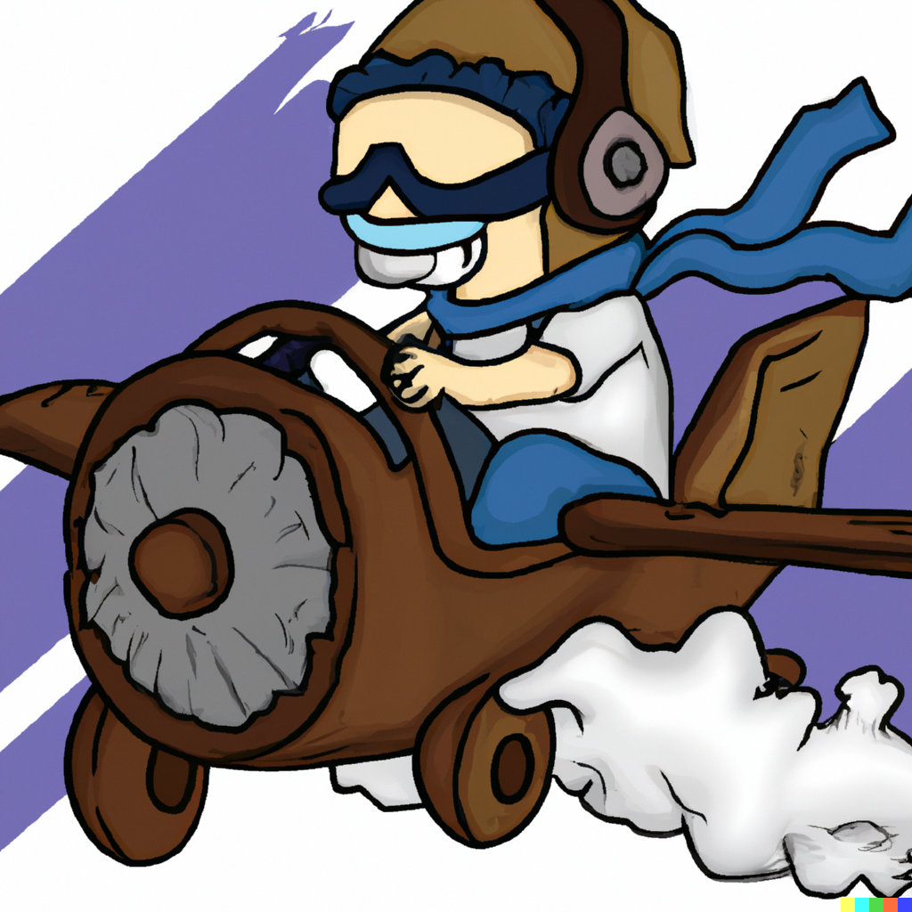

 
<h1 align="center">Copilot</h1>

Shows the next thing you should click.  
Every single step is highlighted, so you can mindlessly grind whilst doing something else.

# Demo
https://user-images.githubusercontent.com/115373370/195444530-a0a17efc-7d8c-4574-b306-4a7f7c64e578.mp4

# Supported activities
## Woodcutting
General purpose for chopping trees and banking the logs.  
* select a tree and log type by clicking it

### Crafting
General purpose for bankstanding skills.  
* enter your tool, for example: knife, glassblowing pipe
* enter your resource, for example: yew logs, molten glass
* enter your product, for example: yew longbow(u), lantern lens

### Fishing & Cooking
Fishing trout and salmon at Barbarian Village, and cooking it.

### General inactivity alert
For unsupported activities.  
Alerts you when you have not yet animated, moved or clicked something for set time.  
Works for a lot of things, but does not show you what to click.

# Features
Configuration options:  
  
Some configuration options further explained:
* Alert delay: after how many milliseconds of inactivity you are alerted.
* Alert sound ID: the sound played when you are alerted. 
You can choose from the [Sound IDs wiki page](https://oldschool.runescape.wiki/w/List_of_in-game_sound_IDs).
* Alt alert sound ID: the sound played when you are alerted and your inventory is full.
* Amount of alerts: the amount of alerts that sound when you are inactive.
You could for example set a single very loud alert, or 1000 soft ticks to keep reminding you to interact with the game.

# Tips
* Use the menu entry swapper plugin to make every action left-clickable.
* Use the camera plugin to zoom out more and enable vertical camera.

# Planned features
* Tempoross
* Giant's Foundry
